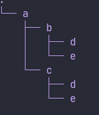

# Welcome to dirf
## what is dirf
- Dirf is simple command line utility to make multiple,nested, recursive directory and files inside them

`$ dirf a/b+c/d+e`
- Here d and e are files and rest are directories.
- Will create a nested directory like this

## setup
- Clone the file 
- Make file executable
- Test in the cloned repo
- Or paste in user binary folder for global uses.
- if `dirf` is too long for you. you can make an alias in your shell.

## Usage
`dirf path_to_create`
`/`		in the end of string will crate a directory
### example
`a/` 		will create a directory
`b` 		will create a file.
`a/b` 		will create a file `b` inside directory `a`.
`a/b+c/` 	will create a directory `b` and `c` inside directory `a`
`a/b+c` 		will create a file `b` and `c`inside directory `a`

## Development
- This is the first iteration. so it may have bugs.
- I will try to add more features.
